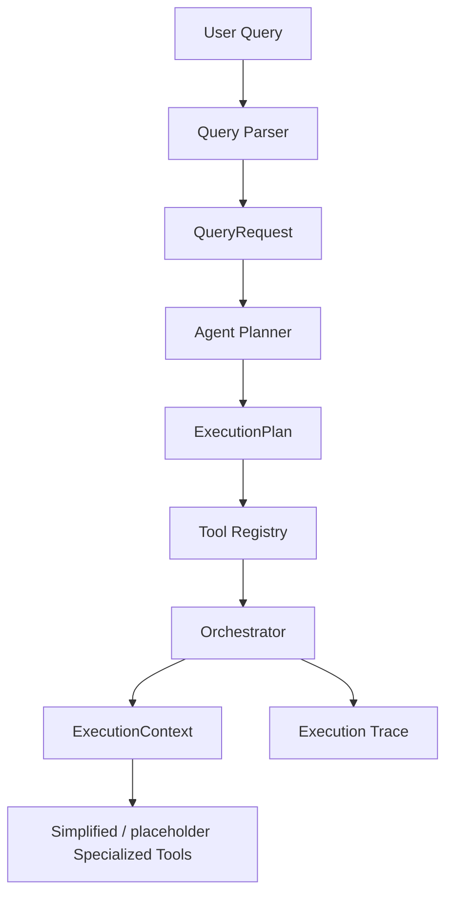

# SentinelAML

Phase 1 scaffold for an agentic AML investigation system.

## Phase 3 Architecture



Phase 3 adds a query-aware planning layer and an execution trace so later AML tools can be plugged in without changing the orchestration contract.

## Current status
- Project skeleton created
- Sample transaction dataset added
- Dataset loader implemented
- Query parser implemented
- Agent planner, tool registry, and orchestrator scaffolded

## Run
From the project root:

```bash
python app.py
```

## Notes
This is the first vertical slice and focuses on reliable data loading and validation.
