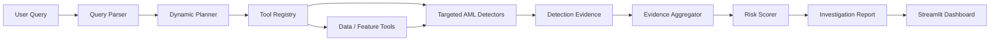

# SentinelAML

**Agentic Suspicious Activity Detection & Explainable AML Investigation**

SentinelAML is a query-driven Anti-Money Laundering (AML) investigation system that analyzes transaction behavior, detects suspicious patterns, produces explainable risk assessments, and generates analyst-oriented investigation reports.

Instead of sending every request through a fixed pipeline, SentinelAML interprets a user's natural-language investigation request and constructs a targeted execution plan, invoking only the analytical components relevant to that request.

> **Responsible Use:** SentinelAML identifies suspicious behavioral patterns for analyst review. It does not establish money laundering, fraud, criminal conduct, or legal liability.

---

## Problem Statement

Financial institutions process large volumes of transactions while attempting to identify suspicious activity associated with money laundering.

Traditional rule-based monitoring can generate large numbers of alerts while sophisticated suspicious behavior may be distributed across multiple transactions, counterparties, and time windows.

SentinelAML addresses this problem through an agent-driven investigation workflow that can:

- Interpret natural-language investigation requests
- Dynamically select relevant AML analysis tools
- Engineer behavioral features when required
- Detect suspicious transaction patterns
- Aggregate supporting evidence
- Generate an explainable risk score
- Provide human-readable investigation findings
- Recommend an appropriate analyst action

The solution focuses on **selective execution, explainability, reproducibility, and human review**.

---

## Why SentinelAML is Agentic

SentinelAML does **not require every query to execute the same fixed sequence**.

A user request is converted into a structured investigation request. The planner identifies the intent and target AML pattern, then determines which analytical tools are necessary.

For example:

```text
User:
"Investigate fan-out activity for this account"

        ↓

Query Parser
Intent: fan_out_detection
Pattern: fan_out

        ↓

Dynamic Planner
Selected Tool: fan_out_detector

        ↓

Targeted Detection

        ↓

Detection Evidence

        ↓

Risk Assessment

        ↓

Investigation Report
```

A circular-transaction query can instead invoke the cycle detector, while a velocity investigation can use the velocity analysis path without unnecessarily executing unrelated pattern detectors.

This provides **deterministic, inspectable, query-driven tool orchestration**.

---

## System Architecture



### Agent Layer

Responsible for understanding the request and deciding what should execute.

- Query parsing
- Intent identification
- AML-pattern identification
- Dynamic execution planning
- Tool registry
- Orchestration contracts

### Data & Feature Layer

Responsible for scalable access to transaction data and reusable AML features.

- IBM AML dataset adapter
- Account/date-targeted loading
- AML-oriented feature engineering
- Reusable feature cache
- Label separation

### Detection Layer

Contains specialized behavioral detectors:

- Fan-Out
- Fan-In
- Velocity
- Cycle / Circular Flow
- Gather-Scatter
- Scatter-Gather

### Risk Layer

Transforms detector evidence into an explainable account-level assessment.

- Evidence deduplication
- Evidence aggregation
- Transparent 0–100 risk scoring
- LOW / MEDIUM / HIGH / CRITICAL classification

### Investigation Layer

Transforms risk assessments into analyst-oriented investigation reports.

- Executive summary
- Key findings
- Evidence timeline
- Score explanation
- Recommended analyst actions
- Investigation limitations

### Presentation Layer

The Streamlit dashboard exposes the complete investigation flow.

- Investigation controls
- Natural-language query
- Risk metrics
- Investigation report
- Score breakdown
- Evidence timeline
- Evidence summary
- Query parser/planner preview

---

# AML Pattern Detection

SentinelAML currently implements **six behavioral AML detectors**.

## 1. Fan-Out

Detects source accounts distributing funds to multiple distinct receivers within a configurable time window.

This can highlight rapid dispersal behavior that may warrant further investigation.

## 2. Fan-In

Detects destination accounts receiving funds from multiple distinct senders within a bounded period.

This can identify concentrated incoming activity from numerous counterparties.

## 3. Velocity

Detects concentrated transaction activity using configurable transaction-velocity thresholds and reusable account features.

Velocity evidence captures unusual transaction frequency or rapid movement without treating high activity alone as proof of suspicious conduct.

## 4. Cycle / Circular Flow

Searches targeted transaction slices for chronologically valid circular transaction paths.

The implementation uses bounded traversal and limits path length and elapsed time to avoid unnecessary global graph processing.

## 5. Gather-Scatter

Detects accounts receiving funds from multiple distinct sources and subsequently distributing funds to multiple destinations within a bounded period.

The detector preserves chronological gather-before-scatter behavior.

## 6. Scatter-Gather

Detects funds distributed through multiple intermediaries that subsequently converge toward a shared destination.

The search is bounded by intermediary and elapsed-time constraints.

> Detector output represents **suspicious-pattern evidence**, not proof of money laundering.

---

# Detection Evidence

Different AML detectors produce a common evidence representation so that downstream components do not depend on detector-specific formats.

Evidence can contain:

- Detector name
- AML typology
- Primary account
- Involved accounts
- Entity identifiers
- Start and end time
- Transaction count
- Suspicious amount
- Evidence strength
- Severity
- Human-readable reasons
- Detector parameters
- Transaction references
- Supporting metadata

This common evidence contract enables multiple detectors to contribute to the same risk assessment.

---

# Evidence Aggregation

Multiple detectors may identify overlapping suspicious activity. Directly adding every alert could artificially inflate risk.

The `EvidenceAggregator` therefore:

1. Groups evidence by primary account
2. Sanitizes label-like metadata
3. Deduplicates identical evidence
4. Handles overlapping transaction references where possible
5. Combines involved accounts and entities
6. Combines detected typologies
7. Calculates the overall assessment period
8. Produces a consolidated account-level evidence representation

Risk scoring therefore operates on consolidated evidence rather than repeatedly rescanning raw transaction data.

---

# Explainable Risk Assessment

The `RiskScorer` converts aggregated evidence into a transparent score between **0 and 100**.

The scoring model intentionally remains deterministic and inspectable.

| Component | Maximum Contribution |
|---|---:|
| Evidence Strength | 32 |
| Severity | 16 |
| Typology Diversity | 16 |
| Repeated Evidence | 16 |
| Activity Magnitude | 16 |

The final score is constrained to the range **0–100**.

## Risk Levels

| Score | Risk Level |
|---:|---|
| 0–24 | LOW |
| 25–49 | MEDIUM |
| 50–74 | HIGH |
| 75–100 | CRITICAL |

Each assessment also contains a score breakdown explaining how individual components contributed to the final result.

> The risk score is a deterministic prioritization mechanism for analyst review. It is **not a probability that money laundering occurred**.

---

# Investigation Reports

`InvestigationReportBuilder` converts a `RiskAssessment` into a structured analyst-facing investigation report.

Reports contain:

- Executive summary
- Risk level and score
- Detected typologies
- Key findings
- Supporting evidence
- Chronological activity timeline
- Score explanation
- Recommended analyst actions
- Investigation limitations
- Compliance disclaimer

The reporting layer is deterministic and does **not require an external LLM API**.

---

# Dataset

SentinelAML uses the **IBM Transactions for Anti Money Laundering (AML)** synthetic benchmark dataset for local development, feature engineering, suspicious-pattern detection, and evaluation.

The implementation uses the **HI-Small** dataset variant.

Raw dataset files are intentionally excluded from Git and stored locally under:

```text
data/raw/ibm_aml/
```

## Dataset Source

- **Dataset:** IBM Transactions for Anti Money Laundering (AML)
- **Dataset type:** Synthetic financial transaction benchmark
- **Source:** Kaggle
- **Dataset page:** https://www.kaggle.com/datasets/ealtman2019/ibm-transactions-for-anti-money-laundering-aml
- **Reference repository:** https://github.com/IBM/AML-Data
- **License:** Community Data License Agreement – Sharing – Version 1.0 (CDLA-Sharing-1.0)

No proprietary banking data or real customer transaction data is included in this repository.

## Local HI-Small Dataset Summary

The following statistics describe the HI-Small transaction data processed locally during development:

| Property | Value |
|---|---:|
| Transactions | 5,078,345 |
| Accounts | 515,080 |
| Laundering-labelled transactions | 5,177 |
| Locally observed date range | 2022-09-01 to 2022-09-18 |
| Dataset variant | HI-Small |
| Dataset type | Synthetic |

The date range above represents the records observed in the locally processed transaction file.

## Files Used

- `HI-Small_Trans.csv` — synthetic transaction records used for local analysis
- `HI-Small_Patterns.txt` — laundering-pattern annotations used only for evaluation

## Canonical Transaction Schema

```text
timestamp
from_bank
sender_account
to_bank
receiver_account
amount_received
receiving_currency
amount_paid
payment_currency
payment_format
is_laundering
```

---

# Label-Leakage Prevention

Ground-truth labels and benchmark annotations are strictly separated from detection and scoring.

- `is_laundering` / `Is Laundering` are evaluation labels only
- Label columns are excluded from detector feature inputs
- `HI-Small_Patterns.txt` annotations are evaluation-only
- Labels are not used by the query planner
- Labels are not used to trigger detector evidence
- Labels are not inputs to risk scoring
- Pattern annotations are not detector thresholds or planner inputs

This prevents benchmark ground truth from artificially influencing suspicious-pattern detection.

---

# Streamlit Dashboard

SentinelAML includes a lightweight interactive investigation dashboard.

The interface provides:

- Demo Investigation
- Targeted Account Investigation
- Account and date controls
- AML typology selection
- Natural-language investigation query
- Risk score
- Risk level
- Evidence count
- Suspicious transaction metrics
- Investigation report
- Score breakdown
- Suspicious-activity timeline
- Evidence summary
- Query parser/planner preview

---

## Demo Mode

Demo Investigation uses deterministic **synthetic evidence** to provide a reliable demonstration path.

The synthetic detector evidence is still processed through the real downstream backend:

```text
Synthetic DetectionEvidence
        ↓
EvidenceAggregator
        ↓
RiskScorer
        ↓
InvestigationReportBuilder
        ↓
Streamlit Dashboard
```

The dashboard explicitly labels this path:

> **Demo / Synthetic Evidence**

Synthetic demonstration results are therefore never represented as real AML findings.

---

# Example Agent Query

```text
Investigate fan-out activity for this account
```

Example interpretation:

```text
Intent: fan_out_detection
Pattern: fan_out
```

Example execution plan:

```text
Planned Tools

1. fan_out_detector
```

The planner therefore avoids executing unrelated AML detectors for this targeted request.

---

# Scalability Decisions

SentinelAML intentionally favors bounded, explainable analysis instead of unnecessary production-scale infrastructure.

Key safeguards include:

- Targeted account/date slices
- Column-selective transaction loading
- Chunk-capable data processing
- Bounded detector time windows
- Bounded cycle traversal
- No mandatory global transaction graph
- No all-pairs graph traversal
- Reusable account feature cache
- Evidence-based risk aggregation
- No full raw-data rescan during risk scoring

These choices make the system appropriate for batch analysis on a sample dataset while maintaining a path toward future production scaling.

---

# Technology Stack

| Area | Technology / Approach |
|---|---|
| Programming Language | Python |
| Data Processing | pandas |
| Frontend | Streamlit |
| Testing | pytest |
| Version Control | Git / GitHub |
| AML Detection | Deterministic rule/statistical behavioral detection |
| Agent Layer | Custom query parser, planner and tool registry |
| Risk Assessment | Explainable deterministic heuristic scoring |
| Reporting | Deterministic investigation report builder |

The SentinelAML runtime does **not require a paid LLM API**.

---

# Project Structure

```text
sentinel-aml/
│
├── agent/                 # Query parsing, planning and tool registry
├── detection/             # AML behavioral detectors
├── investigation/         # Investigation report generation
├── risk/                  # Evidence aggregation and risk scoring
├── tools/                 # Dataset, feature and analytical tools
├── ui/                    # Streamlit UI helpers and demo data
├── tests/                 # Automated regression tests
│
├── data/
│   ├── raw/               # Local raw data - excluded from Git
│   └── processed/         # Local feature cache
│
├── app.py                 # Streamlit application
└── README.md
```

---

# Installation

## 1. Clone the Repository

```bash
git clone https://github.com/sampannashalya/sentinel-aml.git
cd sentinel-aml
```

## 2. Create a Virtual Environment

### Windows

```bash
python -m venv .venv
.\.venv\Scripts\activate
```

### macOS / Linux

```bash
python -m venv .venv
source .venv/bin/activate
```

## 3. Install Dependencies

If using the repository dependency file:

```bash
pip install -r requirements.txt
```

---

# Run SentinelAML

Launch the Streamlit application from the project root:

```bash
streamlit run app.py
```

Alternatively:

```bash
python -m streamlit run app.py
```

Open the local Streamlit address displayed in the terminal.

For the guaranteed reproducible demonstration path:

1. Select **Demo Investigation**
2. Enter or retain the demonstration account
3. Select the desired typologies
4. Click **Run Investigation**

---

# Run Tests

From the repository root:

```bash
python -m pytest -q
```

During final hackathon verification, the complete regression suite reached:

```text
127 passed
```

The test suite covers areas including:

- Query parsing
- Dynamic planning
- Tool registry behavior
- IBM dataset adaptation
- Feature engineering
- AML detector behavior
- Label-leakage safeguards
- Evidence aggregation
- Risk scoring
- Investigation reporting
- Streamlit UI helper contracts

---

# Limitations

SentinelAML is a hackathon prototype rather than a production AML transaction-monitoring platform.

Current limitations include:

- Deterministic heuristic risk scoring rather than a calibrated probability model
- Behavioral patterns may have legitimate explanations
- Bounded cycle detection can intentionally miss longer paths
- Conservative gather/scatter detection rather than exhaustive graph enumeration
- Limited external customer/KYC context
- Targeted raw-data investigation can be slower than synthetic demo mode
- No live transaction-streaming infrastructure
- No automatic regulatory filing

All alerts require appropriate human investigation.

---

# Future Scope

Potential extensions include:

- Unsupervised and semi-supervised anomaly detection
- Analyst feedback and threshold calibration
- Additional structuring and smurfing indicators
- Customer/KYC context
- Graph analytics for complex layering
- Sanctions/watchlist enrichment
- Downloadable investigation packages
- Detector precision/recall evaluation
- Risk-model calibration
- Production-scale streaming infrastructure

---

# External Tools & AI Assistance

This project was developed during the hackathon with assistance from AI and agentic coding tools, as permitted by the hackathon rules.

AI assistance was used for activities including:

- Architecture and implementation support
- Repository-aware coding assistance
- Debugging
- Test generation and review
- Refactoring
- Documentation assistance
- Code-quality review

Tools used during development included:

- **ChatGPT** — architecture discussion, debugging guidance, documentation, testing guidance and implementation review
- **AI coding agents integrated with the development environment** — repository-aware implementation, debugging, refactoring and testing assistance

AI-assisted changes were reviewed, tested and integrated into the project repository.

The SentinelAML runtime itself does **not depend on an external generative-AI API** for query planning, AML detection, risk scoring, or investigation-report generation.

Open-source dependencies used by the project are documented through the repository's dependency configuration.

---

# Responsible Use

SentinelAML is intended to assist AML analysts by identifying and prioritizing suspicious behavioral patterns.

A **HIGH** or **CRITICAL** risk result indicates that observed activity warrants additional review. It does **not** mean that an account holder has committed money laundering or another crime.

SentinelAML should be treated as a **decision-support and investigation-prioritization system**.

Final escalation, reporting, and regulatory decisions must remain with appropriately authorized human reviewers.

---

# Repository

**Public GitHub Repository:**  
https://github.com/sampannashalya/sentinel-aml

---

# Hackathon Implementation Status

- Agentic query parsing — **Complete**
- Dynamic execution planning — **Complete**
- IBM AML dataset integration — **Complete**
- Scalable feature engineering — **Complete**
- Fan-Out detection — **Complete**
- Fan-In detection — **Complete**
- Velocity detection — **Complete**
- Cycle detection — **Complete**
- Gather-Scatter detection — **Complete**
- Scatter-Gather detection — **Complete**
- Evidence aggregation — **Complete**
- Explainable risk scoring — **Complete**
- Investigation report generation — **Complete**
- Streamlit dashboard — **Complete**
- Query planner visualization — **Complete**
- Automated regression suite — **127 passing**
- Manual end-to-end dashboard verification — **Complete**