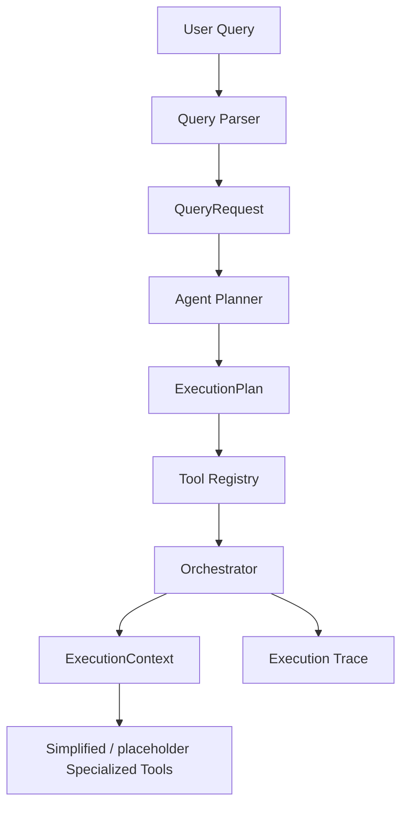

# SentinelAML

Phase 1 scaffold for an agentic AML investigation system.

## Phase 4 Data + Features

The local IBM AML files in `data/raw/ibm_aml/` are synthetic benchmark data, intentionally excluded from Git, and used only for local development and feature engineering.

Dataset summary:
- Name: IBM HI-Small synthetic AML benchmark
- Scale: 5,078,345 transactions and 515,080 accounts
- Labels: 5,177 laundering-labeled transactions
- Date range: 2022-09-01 00:00 through 2022-09-18 16:18

Canonical transaction schema:
- `timestamp`, `from_bank`, `sender_account`, `to_bank`, `receiver_account`, `amount_received`, `receiving_currency`, `amount_paid`, `payment_currency`, `payment_format`, `is_laundering`

Feature categories:
- Volume and amount
- Counterparty and network
- Temporal and velocity
- Diversity
- AML-relevant raw indicators

Median handling:
- Median features are computed with a bounded streaming estimator so they remain available without storing all transaction amounts per account.

Feature cache:
- Offline feature builds can be cached under `data/processed/ibm_feature_cache/` and reused later by the query layer.

Label-leakage policy:
- `is_laundering` stays separate as ground truth only
- It is never added to engineered feature columns or detector inputs

Phase 4 adds a dedicated IBM dataset adapter plus scalable account-level feature engineering on top of the canonical transaction schema.

## Phase 3 Architecture



Phase 3 adds a query-aware planning layer and an execution trace so later AML tools can be plugged in without changing the orchestration contract.

## Current status
- Project skeleton created
- Sample transaction dataset added
- Dataset loader implemented
- Query parser implemented
- Agent planner, tool registry, and orchestrator scaffolded
- IBM dataset adapter and scalable feature engineering added

## Run
From the project root:

```bash
python app.py
```

## Notes
This is the first vertical slice and focuses on reliable data loading and validation.
